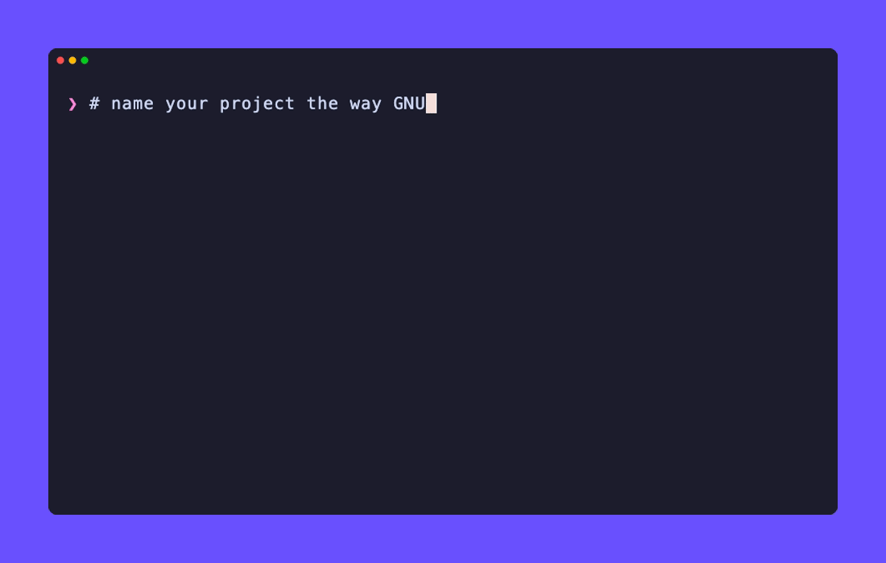

# PRAG

**PRAG**'s a **R**ecursive **A**cronym **G**enerator — a small CLI tool written in C that generates GNU/WINE-style recursive acronyms for open-source projects.

You know how GNU stands for "GNU's Not Unix" and WINE stands for "WINE Is Not an Emulator"? PRAG helps you come up with names like that for your own projects.



## Installation

```sh
brew install JeeNeeUhs/tap/prag
```

## Build from source

```sh
git clone https://github.com/JeeNeeUhs/PRAG.git
cd PRAG
make
# This copies `PRAG` to `/usr/local/bin/`, making it available everywhere.
# sudo make install
```

### Clean up

```sh
make clean    # remove build artifacts
make fclean   # remove build artifacts and the binary
make re       # rebuild from scratch
```

## Usage

```sh
PRAG [OPTIONS] <char> <project-to-replace>
```

### Options

| Flag | Description |
|------|-------------|
| `-h` | Show the help message |
| `-v` | Show version number |
| `-i` | Use `"is not"` instead of `"'s not"` (cannot be combined with `-s`, `-p`, `-r`, `-n`) |
| `-l` | Use a full string prefix (all chars are included in the acronym) (cannot be combined with `-a`, `-s`) |
| `-s` | Shorten mode: build the acronym from the uppercase first letters of each argument (cannot be combined with `-i`, `-p`, `-r`, `-n`, `-l`, `-a`) |
| `-p` | Use `"'s"` instead of `"'s not"` — the "not" disappears from the acronym (cannot be combined with `-i`, `-s`, `-r`, `-n`) |
| `-r` | Use `"is"` instead of `"'s not"` (cannot be combined with `-i`, `-s`, `-p`, `-n`) |
| `-n` | Print only the acronym, nothing in between (cannot be combined with `-i`, `-s`, `-p`, `-r`) |
| `-a` | Try every letter A-Z as the prefix, so `<char>` is not given (works with `-i`, `-p`, `-r`, `-n`; cannot be combined with `-l`, `-s`) |

> **Note:** `-i`, `-s`, `-p`, `-r`, `-n` are mutually exclusive. Only one of them can be used at a time.

### Arguments

| Argument | Description |
|----------|-------------|
| `<char(s)>` | The character (or string with `-l`) to start the acronym with — e.g. `G` for GNU, `W` for WINE |
| `<project-to-replace>` | The existing project your project is "not" — e.g. `unix`, `emulator` |

## Examples

```text
$ PRAG G unix
GNU, GNU's not unix
 
$ PRAG -i W emulator
WINE, WINE is not emulator
 
$ PRAG -l GNU unix
GNUNU, GNUNU's not unix
 
$ PRAG -s Yet Another Markup Language
YAML, Yet Another Markup Language
 
$ PRAG -r P Recursive Acronym Generator
PIRAG, PIRAG is Recursive Acronym Generator
 
$ PRAG -p P Recursive Acronym Generator
PRAG, PRAG's Recursive Acronym Generator
 
$ PRAG -n R Project Manager
RPM, RPM Project Manager

$ PRAG -a unix
ANU, ANU's not unix
BNU, BNU's not unix
...
ZNU, ZNU's not unix

$ PRAG -a -i emulator
AINE, AINE is not emulator
...
ZINE, ZINE is not emulator
```

## Contributing

Contributions, bug reports, and feature ideas are welcome. Feel free to open an issue or pull request.

## License

Check the [LICENSE](./LICENSE) file for details.
